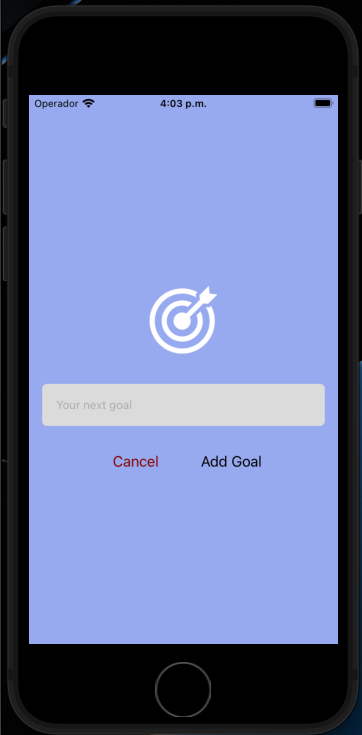
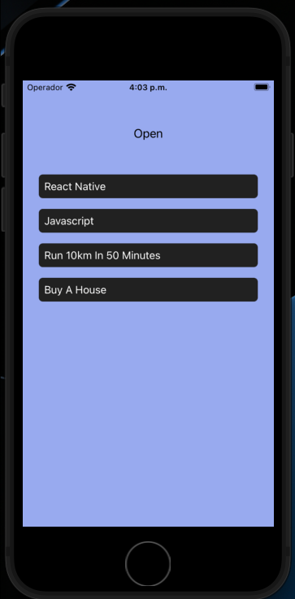
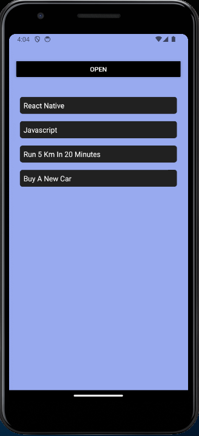
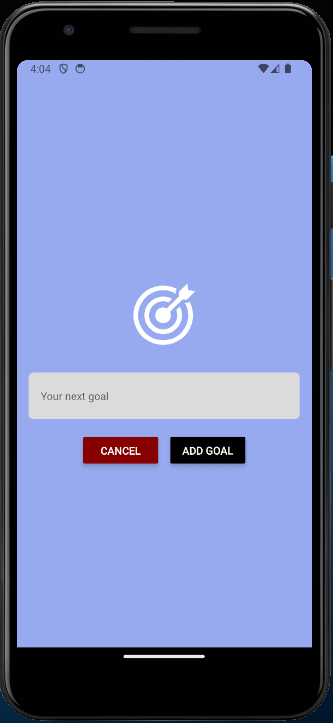

# Goal Tracker App

The Goal Tracker App is a simple React Native application that allows users to add and track their goals. Users can input their goals and delete them as needed.

## Table of Contents

- [Features](#features)
- [Screenshots](#screenshots)
- [Getting Started](#getting-started)
  - [Prerequisites](#prerequisites)
  - [Installation](#installation)
- [Usage](#usage)

## Features

- Add new goals with a user-friendly input modal.
- Delete goals by pressing on them.
- Goal items have a unique visual style and include a ripple effect on press.
- User interface designed with a clean and intuitive layout.

## Screenshots

iOS:

Andriod:

## Getting Started

To get started with the Goal Tracker App on your local machine, follow these instructions.

### Prerequisites

- Node.js and npm (Node Package Manager)
- Expo CLI (for React Native development)
- An Android/iOS emulator or a physical device to test the app

### Installation

1. Clone the repository:

git clone https://github.com/your-username/goal-tracker-app.git

2. Navigate to the project folder:

cd goal-tracker-app

3. Install the dependencies:

4. Start the development server:

npm start

5. Use the Expo CLI to run the app on an emulator or physical device:

expo start

## Usage

1. Open the app on your emulator/device.
2. Press the "Open" button to add a new goal.
3. Enter your goal in the text input and press "Add Goal".
4. Your goal will be added to the list.
5. Press on a goal to delete it.

**Technologies Used:**

- React Native
- Expo
- TypeScript
- Node.js
- npm
- CSS in JS

